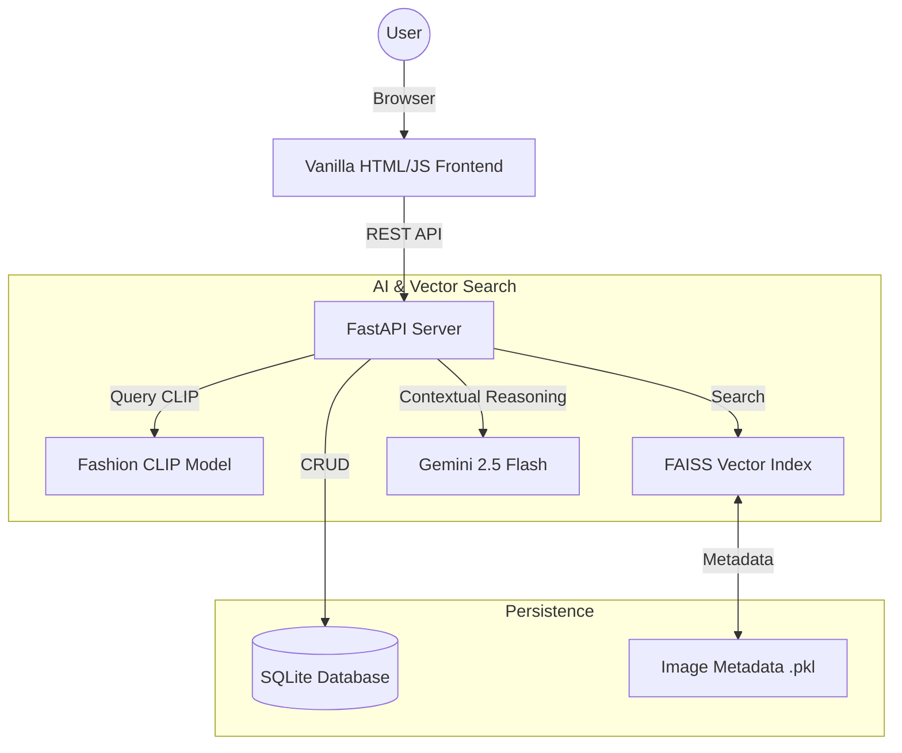
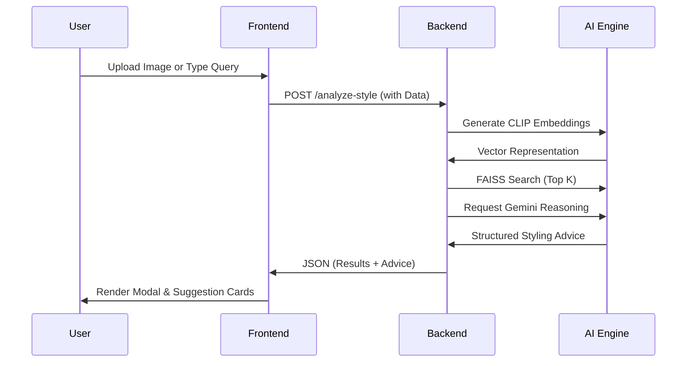

# 🪄 StyleGenie AI - Personalized Fashion Stylist

StyleGenie AI is a high-fidelity, multimodal fashion recommendation system. It combines state-of-the-art Computer Vision (CLIP) with Large Language Models (Gemini 2.5 Flash) to offer a conversational and visual styling experience.

## ✨ Key Features

- **🛍️ High-Fidelity UI**: Interactive dashboard with glassmorphism design, soft pastel themes, and smooth animations.
- **🧣 AI Conversational Stylist**: A context-aware stylist that remembers your preferences, asks progressive questions, and provides structured advice.
- **📸 Visual Search**: Upload an image of an outfit to find similar items in our curated 5,000+ item database.
- **💎 Personal Collection**: Save your favorite looks and view your styling history anytime.
- **⚙️ Contextual Intelligence**: Filters results based on occasion (Formal, Casual, Party) and season (Summer, Winter, Fall, Spring).

## 📊 System Architecture



## 🔄 Project Workflow



## 🚀 Advanced Tech Stack

StyleGenie AI leverages a hybrid architecture combining retrieval-augmented generation (RAG) with state-of-the-art computer vision and NLP models.

- **Multimodal Embedding Engine**:
    - **Fashion-CLIP** (`patrickjohncyh/fashion-clip`): A contrastive language-image model fine-tuned on fashion-specific datasets for high-precision visual and textual alignment.
    - **FashionBERT**: Used for extracting semantic style attributes and refining text queries to reduce ambiguity in fashion terminology.
- **Reasoning & Synthesis Layer**:
    - **Google Gemini 2.5 Flash**: Orchestrates the conversational styling logic, providing explainable reasoning for each recommendation.
    - **Large-Scale Inference**: Optimized for low-latency response generation using modern LLM distillation techniques.
- **Vector Search Infrastructure**:
    - **FAISS (Facebook AI Similarity Search)**: Utilizes **IndexFlatL2** for exhaustive yet rapid similarity search across high-dimensional fashion embeddings.
- **Backend & Persistence**:
    - **FastAPI**: Asynchronous, high-performance Python framework for building industrial-grade APIs.
    - **SQLAlchemy ORM**: Handles relational data mapping for user history, preferences, and saved collections in **SQLite**.
- **Frontend Architecture**:
    - **Modern UI Suite**: Vanilla JS/HTML/CSS with glassmorphism components, ensuring zero overhead and maximum performance compared to bloated frameworks.

## 🌟 Unique Features & Innovations

StyleGenie AI goes beyond simple recommendation by acting as a true "Styling Agent."

1. **Multimodal Reasoning**: Can process an image of a celebrity or a messy wardrobe photo alongside a text query like *"make this more formal"*, understanding the interplay between visual and textual context.
2. **Culturally-Aware Recommendations**: Integrates dual datasets covering both **Indian Ethnic Fashion** and **Modern Western Styles**, bridging the gap in mainstream fashion AI.
3. **Progressive Stylist "Genie"**: The chatbot doesn't just answer; it asks. It transitions through *Discovery, Recommendation, and Follow-up* phases to refine your look progressively.
4. **Explainable AI Styling**: For every outfit suggested, StyleGenie explains *why* it works—considering color theory, fabric compatibility, and the specific occasion.
5. **UI-Ready Structured Output**: All AI responses are delivered as structured JSON, enabling the frontend to render interactive cards, accessory sections, and high-fidelity product galleries.

## ⚡ Performance Engineering

We have implemented several optimizations to ensure a "lighting-fast" user experience:

- **Sub-100ms Vector Retrieval**: By utilizing FAISS-based indexing, we avoid expensive linear database scans, enabling sub-100ms retrieval even as the dataset grows.
- **Embedding Normalization & Caching**: All query embeddings are unit-normalized to ensure mathematical consistency with L2 distance calculations. Frequently used model weights are cached in-memory for zero bootstrap delay.
- **Result Deduplication & Context Filtering**: An intelligent post-retrieval layer removes near-duplicates and applies hard filters for occasion/season *before* the LLM synthesizes the look, reducing tokens and latency.
- **Asynchronous Data Flow**: The FastAPI backend handles I/O operations asynchronously, allowing styling advice generation and database persistence to occur in parallel without blocking the main event loop.
- **Scalable Dataset Partitioning**: Data is partitioned into domain-specific indices (Indian vs Western), significantly reducing search space and improving the relevance of localized trends.


## 🛠️ Setup Instructions

1. **Clone the repository**:
   ```bash
   git clone https://github.com/Anughna04/ai-fashion-styling-assistant.git
   cd fashion
   ```

2. **Install dependencies**:
   ```bash
   pip install -r requirements.txt
   ```

3. **Configure Environment**:
   Create a `.env` file and add your GEMINI_API_KEY:
   ```env
   GEMINI_API_KEY=your_key_here
   ```

4. **Initialize Database**:
   ```bash
   python unified_faiss_index.py
   ```

5. **Run the App**:
   ```bash
   uvicorn main:app --reload
   ```
   Open `http://127.0.0.1:8000/frontend/index.html` in your browser.


## 👨‍💻 Developed By
**Anughna - AI Styling Assistant Project**
*From ethnic elegance to modern trends, find what truly fits you.*
