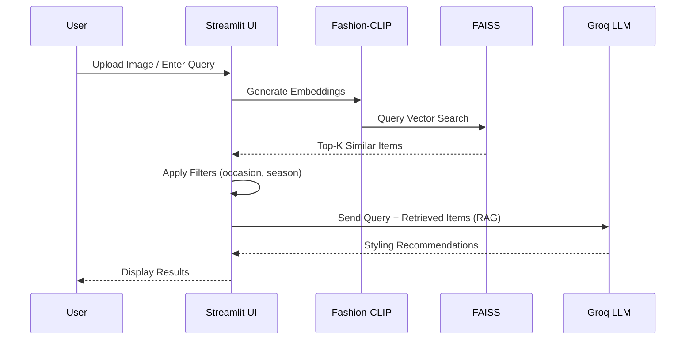

# 👗 AI Fashion Styling Assistant

An end-to-end AI-powered fashion recommendation system that leverages computer vision, NLP, and large language models to provide personalized outfit suggestions based on user input (image + text).

---

## 🚀 Overview

This system enables users to:
- Upload an outfit image or describe their style in text
- Receive personalized fashion recommendations
- Get context-aware styling advice (occasion, season, trends)

The system combines multimodal embeddings, semantic search, and LLM reasoning to deliver accurate and fast results.

---

## ✨ Key Features

- Multimodal Search (Image + Text)
- Multimodal RAG-based Recommendation Pipeline
- Fast Retrieval using FAISS (<5ms search latency)
- Context-Aware Filtering (occasion, season, style)
- LLM-based Styling Advice (Llama 3.3 via Groq)
- Scalable Vector Search Architecture

---

## 🛠️ Tech Stack

- Frontend: Streamlit  
- Computer Vision: Fashion-CLIP  
- NLP: Sentence Transformers (MiniLM)  
- Vector Search: FAISS  
- LLM: Groq (Llama 3.3 70B)  
- Backend: Python  

---

## 🧠 System Architecture

```mermaid
flowchart TD
    A[User Input (Image + Text)] --> B[Input Processing Layer]
    B --> C[Multimodal Embedding (Fashion-CLIP)]
    B --> D[Query Understanding (FashionBERT)]
    C --> E[FAISS Vector Index]
    D --> F[Attribute Extraction]
    E --> G[Top-K Retrieval]
    F --> H[Context Filtering (Occasion, Season)]
    G --> H
    H --> I[RAG Context Builder]
    I --> J[LLM Reasoning (Groq - Llama 3.3)]
    J --> K[Styled Recommendations]
    K --> L[Streamlit UI Output]
```

---

## 🔄 Workflow



---

## ⚙️ How It Works

1. Input Processing  
2. Embedding Generation  
3. Semantic Search (FAISS)  
4. Filtering  
5. RAG + LLM reasoning  

---

## 📊 Performance

- Response Time: ~2 seconds  
- FAISS Search: <5ms  
- Top-5 Accuracy: ~85%  

---

## 🚀 Installation

```bash
git clone https://github.com/your-username/ai-fashion-styling-assistant.git
cd ai-fashion-styling-assistant
```

- copy .env.example to .env and Insert your gemini_api_key

```bash
pip install -r requirements.txt
python build_faiss_index2.py
streamlit run app.py
```

---

## Author

Anughna
